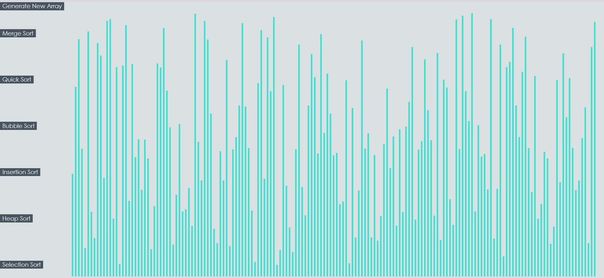
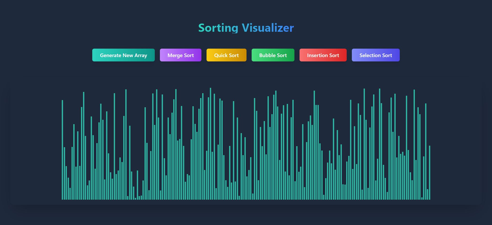

# Sorting Visualizer
A visualization for various sorting algorithms like merge sort, heap sort, quick sort, insertion sort, bubble sort and selection sort. 
Access it using this link https://csals.github.io/Sorting-Visualizer/

Rewrote it with **Cursor + Claude** to enhance the UI and complete all the TODOs

## before & after

Before:

After:

## NOTES
- in every sorting algo I am returning two comparisions.
- that's because when I am comparing 2 bars first I will change their color to red and again need to change to original color
- for that reason every time 2 bars are compared we need 2 comparisions

- Huge thanks to [Clément Mihailescu](https://github.com/clementmihailescu) for this project idea.
